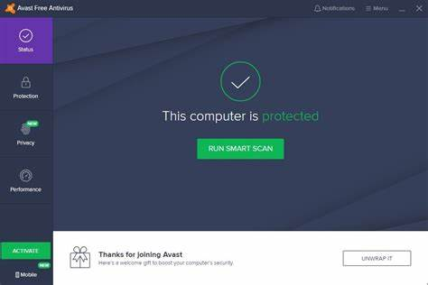

# avast-documentation
This is the project number 1 
# Avast - Your Comprehensive Security Solution 🔒

Avast is a robust antivirus and security application designed to protect your devices from malware, viruses, and other online threats. With user-friendly features and advanced security measures, Avast ensures your online safety and privacy. 🛡️💻

---

## Key Features ✨

- **🦠 Real-Time Protection**: Monitors your system for threats in real-time.
- **🌐 Web Shield**: Blocks malicious websites and phishing attempts.
- **📥 Email Protection**: Scans incoming emails for harmful attachments.
- **🧑‍🤝‍🧑 VPN Service**: Securely browse the internet with our built-in VPN.
- **📊 Performance Optimization**: Boost your device's performance with one-click cleanup tools.

---

## Installation Guide 💻

To install Avast, follow the steps below based on your operating system:

1. **Windows** 🪟:
    ```bash
    # Download and run the Avast installer
    curl -O https://download.avast.com/AvastInstaller.exe
    ./AvastInstaller.exe
    ```

2. **macOS** 🍏:
    ```bash
    # Install Avast from the official website
    open https://download.avast.com/avast-mac.dmg
    ```

3. **Linux** 🐧:
    ```bash
    # Use the following command to install Avast on Debian-based systems
    sudo apt-get install avast
    ```

---

## User Guide 📚

### 📂 Setting Up Avast

To set up Avast on your device:
- [ ] Open the Avast app after installation.
- [ ] Follow the on-screen instructions to complete the setup.
- [ ] Run the initial scan to detect any existing threats.
- [ ] Configure your protection settings as desired.

### 🤝 Security Features

Avast offers several security features to enhance your protection:

| Security Feature      | Description                              |
|-----------------------|------------------------------------------|
| **🦠 Smart Scan**      | Comprehensive scan for viruses and vulnerabilities. |
| **🔒 Firewall**        | Monitors incoming and outgoing network traffic. |
| **👤 Identity Protection** | Safeguards personal information from theft. |

## Avast User Interface Screenshot



---

## Troubleshooting 🛠️
Here are some common issues users might encounter while using Avast, along with their definitions and solutions:

### Common Issues

- **⚠️ Installation Errors**  
  *Definition*: Errors that occur during the installation process, preventing Avast from being installed successfully.  
  *Solution*: Ensure your system meets the minimum requirements. Check for existing antivirus software that may need to be uninstalled before proceeding.

- **🌐 Connectivity Issues**  
  *Definition*: Problems related to network connections that affect updates or online features.  
  *Solution*: Verify your internet connection. Restart your router if necessary, and check firewall settings to ensure Avast is allowed to connect.

- **🐢 Slow Scanning**  
  *Definition*: The scan process takes longer than expected to complete.  
  *Solution*: Restart the Avast application. Consider clearing cache files or scheduling scans during off-peak hours to improve performance.

---
## 🔗 Integrations

Avast can integrate with various applications for enhanced security:

| Application       | Description                             | Link                       |
|-------------------|-----------------------------------------|----------------------------|
| 📅 Google Drive   | Scan files uploaded to Google Drive     | [drive.google.com](https://drive.google.com) |
| 💬 Slack          | Receive security alerts in Slack        | [slack.com](https://slack.com) |
| 📌 Dropbox        | Securely scan files stored in Dropbox   | [dropbox.com](https://dropbox.com) |

## Advanced Usage 🔧

### ⚙️ Scripting

Avast allows users to automate certain tasks using scripting. This feature helps streamline repetitive processes, making it easier to maintain security measures without constant manual intervention.

Here’s an example script that schedules a daily security scan:

```javascript
// Schedule a daily security scan at 3 AM
function scheduleDailyScan() {
  const scanTime = new Date();
  scanTime.setHours(3, 0, 0); // 3 AM
  scheduleScan(scanTime, 'Full Scan');
}
```
### 📊 Performance Insights

Avast provides real-time performance metrics for your device:

```json
{
  "system_health": "Good",
  "threats_detected": 2,
  "scans_completed": 5,
  "last_scan": "2024-10-28"
}
```
---
